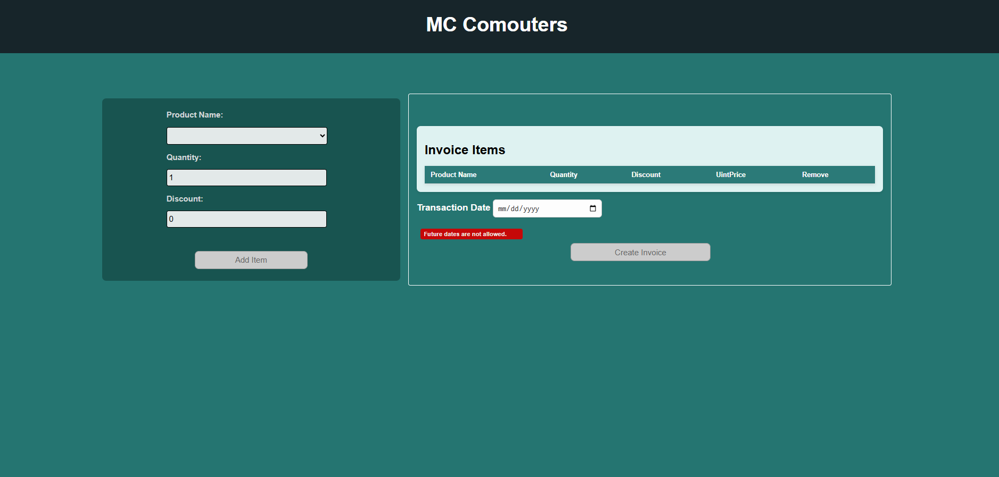
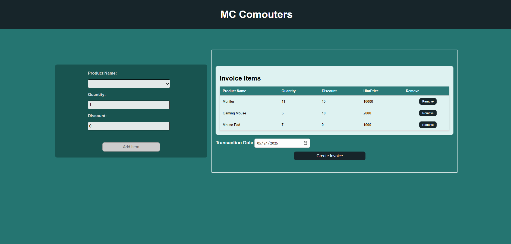
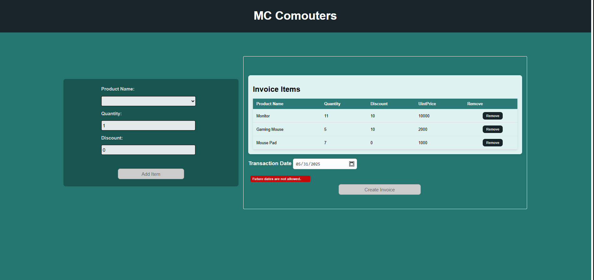
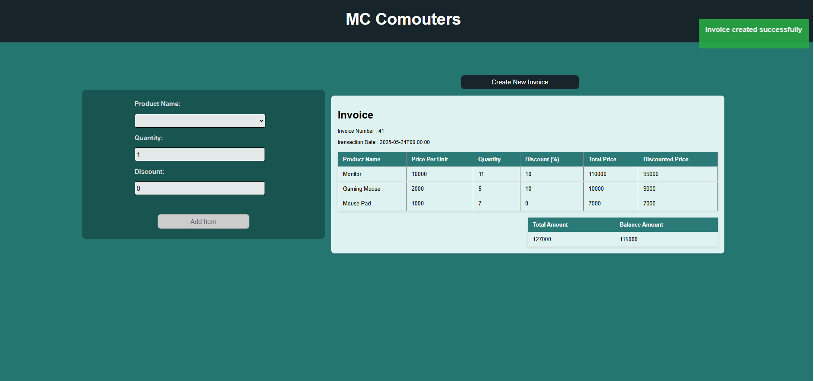

# Retail_Shop
Technical Assignment JIT Resourcing &amp; Consultancy Services

Tech Stack

    Frontend: Angular
    Backend: ASP.NET Core Web API
    Database: MS SQL Server
    ORM: Entity Framework Core

Setup Instructions
    git clone https://github.com/NayaniDineshika/Retail_Shop.git
    

Backend Setup (ASP.NET Core)
    Navigate to Backend
    cd Backend/Reail_Shop_Backend

    Update DB connection string in appsettings.json
    "ConnectionStrings": {
    "DefaultConnection": "Server=<Your_ServerName>;Database=RetailDB;Integrated Security=True;MultipleActiveResultSets=true;TrustServerCertificate=True;;"
    }

    Apply EF Migrations
        dotnet ef migrations add InitialCreate
        dotnet ef database update

    Run the API
        dotnet run

Frontend Setup (Angular)
    Navigate to Frontend
        cd Frontend/Reail_Shop_Frontend

    Install dependencies
        npm install
    Run the Angular App
        ng serve

Running Unit Tests
dotnet test

Dependencies (NuGet Packages)
    Microsoft.EntityFrameworkCore
    Microsoft.EntityFrameworkCore.SqlServer (or MySQL provider if used)
    Microsoft.EntityFrameworkCore.Tools
    Microsoft.AspNetCore.Mvc
    NUnit
    Moq 

Assumptions Made
  Does not include any user authentication or authorization mechanisms.
  Discounts are applied on the total price of each product item
  Discounted Price per Item = Quantity × UnitPrice × (1 - DiscountPercentage/100)
  Each invoice can contain one or more invoice items. Every invoice item must refer to an existing product in the product.
  The transaction date must be entered manually by the user.
  Users are not allowed to select a future date; only the current date or any past date can be used.

Page Screenshots

